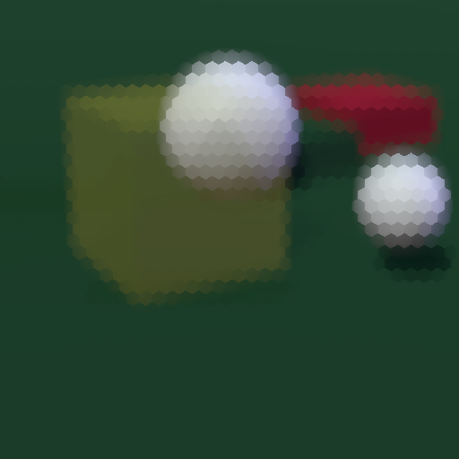
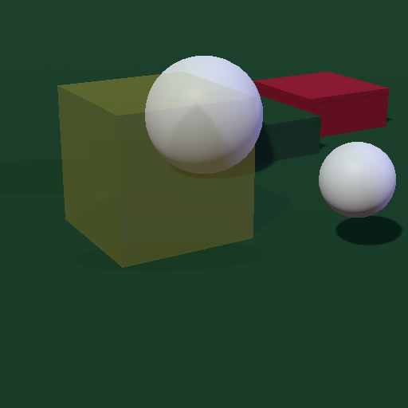

# XELF.Hexelate.Shader
* XELF.Hexelate.Shader: Hexelation Shader is an image effect for Unity. Screen will be filtered by hexagonal grids.
* Tested with Unity `2018.2.7f1` `2018.3.0b1`

# Sample

* Hexelated screenshot



* Not hexelated screenshot



# Install

1. Copy this project files to your local project folder.

# Install via Package Manager in Unity 2018.2.x

* Temporal `package.json` is contained for the future. ☛[Unity Package Manager](https://docs.unity3d.com/Packages/com.unity.package-manager-ui@1.9/manual/index.html)

Or you can manually modify `Assets/Packages/manifest.json` on your project for Unity 2018+.
1. Copy this project files to your local folder.
2. Insert a line to `Assets/Packages/manifest.json` as a relative file path to your local `XELF.Hexelate.Shader` folder like below.

```javascript
{
    "dependencies": {
        "info.xelf.shaders.hexelate": "file:../../XELF.Hexelate.Shader"
    }
}
```

# Install via Package Manager in Unity 2018.3.0b1+

1. Copy this project files to your local folder.
2. Open your project in Unity
3. Select `Main Menu`: `Window`➡`Package Manager`
4. Click `+` Button
5. Select `Add package from disk...` to open the file dialog
6. Select the `package.json` from your local folder (of step 1)

# How to integrate into a new scene

* Simple script `Hexelate.cs` has ☛[`Monobehaviour.OnRenderImage`](https://docs.unity3d.com/ScriptReference/MonoBehaviour.OnRenderImage.html) method.

1. Add the `Hexelate` component to your camera.
2. Hexelation image effect can be seen in the game window.
3. You can control the effect parameters via `Hexelate.mat` on the inspector window.

